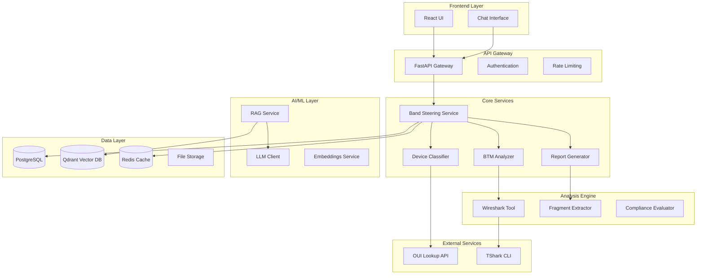
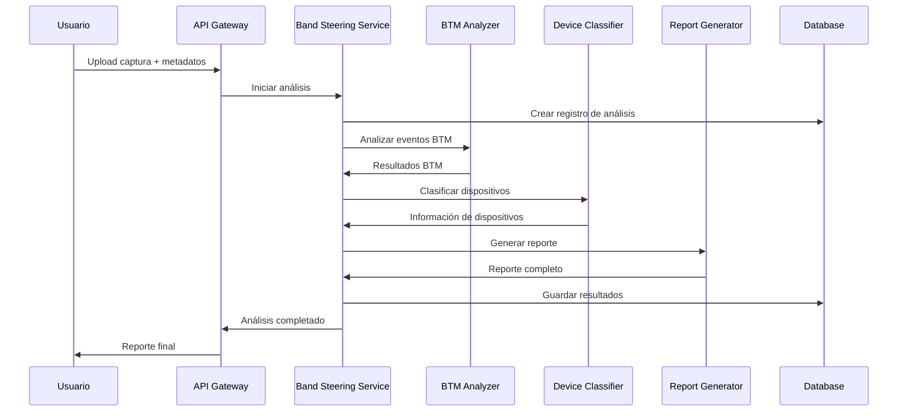
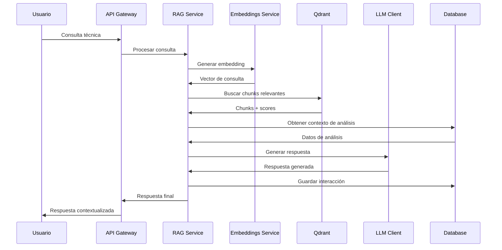

# 🏗️ AIDLC - Fase 2: Diseño Arquitectónico

## 🎯 Visión Arquitectónica

### Principios de Diseño
1. **Modularidad**: Componentes independientes y reutilizables
2. **Escalabilidad**: Capacidad de manejar volúmenes crecientes
3. **Extensibilidad**: Fácil adición de nuevos analizadores
4. **Observabilidad**: Trazabilidad completa del proceso
5. **Resiliencia**: Manejo robusto de errores y fallos

### Patrones Arquitectónicos
- **Microservicios**: Servicios especializados por dominio
- **Event-Driven**: Comunicación asíncrona entre componentes
- **CQRS**: Separación de comandos y consultas
- **Repository Pattern**: Abstracción de acceso a datos
- **Strategy Pattern**: Algoritmos intercambiables de análisis

## 🏛️ Arquitectura de Alto Nivel



## 📦 Componentes Principales

### 1. Band Steering Service (Orquestador Principal)
**Responsabilidad**: Coordinar el análisis completo de capturas
```
Inputs: Archivo de captura, metadatos opcionales
Outputs: Reporte completo de análisis
Dependencies: BTM Analyzer, Device Classifier, Report Generator
```

**Funciones Clave**:
- Orquestar flujo de análisis completo
- Gestionar estado de procesamiento
- Coordinar servicios especializados
- Generar reportes consolidados

### 2. BTM Analyzer (Motor de Análisis BTM)
**Responsabilidad**: Análisis especializado de eventos BTM
```
Inputs: Eventos 802.11 extraídos
Outputs: Análisis BTM estructurado
Dependencies: Wireshark Tool
```

**Funciones Clave**:
- Detectar códigos BTM (0-8)
- Clasificar patrones de steering
- Calcular métricas de rendimiento
- Evaluar cumplimiento KVR

### 3. Device Classifier (Clasificador de Dispositivos)
**Responsabilidad**: Identificación y categorización de dispositivos
```
Inputs: MAC addresses de dispositivos
Outputs: Información de marca/modelo
Dependencies: OUI Lookup Service
```

**Funciones Clave**:
- Lookup automático de fabricantes
- Categorización por tipo de dispositivo
- Gestión de caché de OUIs
- Detección de dispositivos virtuales

### 4. Report Generator (Generador de Reportes)
**Responsabilidad**: Creación de reportes y visualizaciones
```
Inputs: Análisis consolidado
Outputs: Reportes HTML/PDF, fragmentos
Dependencies: Fragment Extractor
```

**Funciones Clave**:
- Generar reportes ejecutivos
- Crear visualizaciones de datos
- Extraer fragmentos relevantes
- Exportar en múltiples formatos

### 5. Fragment Extractor (Extractor de Fragmentos)
**Responsabilidad**: Extracción de secuencias relevantes
```
Inputs: Archivo de captura, eventos clave
Outputs: Fragmentos filtrados
Dependencies: TShark
```

**Funciones Clave**:
- Filtrar paquetes por criterios
- Extraer secuencias temporales
- Generar capturas filtradas
- Crear timelines visuales

## 🗄️ Diseño de Base de Datos

### Modelo de Datos Principal

```sql
-- Tabla principal de análisis
CREATE TABLE capture_analyses (
    id UUID PRIMARY KEY DEFAULT gen_random_uuid(),
    filename VARCHAR(255) NOT NULL,
    file_hash VARCHAR(64) UNIQUE,
    file_size BIGINT,
    upload_timestamp TIMESTAMP DEFAULT NOW(),
    analysis_timestamp TIMESTAMP,
    status VARCHAR(50) DEFAULT 'pending',
    
    -- Metadatos de análisis
    total_packets INTEGER,
    wlan_packets INTEGER,
    analysis_duration_ms INTEGER,
    
    -- Resultados principales
    overall_verdict VARCHAR(50),
    compliance_score DECIMAL(3,2),
    
    -- Análisis BTM
    btm_requests INTEGER DEFAULT 0,
    btm_responses INTEGER DEFAULT 0,
    btm_success_rate DECIMAL(3,2),
    
    -- Métricas de transición
    successful_transitions INTEGER DEFAULT 0,
    failed_transitions INTEGER DEFAULT 0,
    avg_transition_time DECIMAL(6,3),
    max_transition_time DECIMAL(6,3),
    
    -- Flags de problemas
    loops_detected BOOLEAN DEFAULT FALSE,
    timeouts_detected BOOLEAN DEFAULT FALSE,
    
    -- Datos JSON para flexibilidad
    raw_analysis JSONB,
    compliance_checks JSONB,
    recommendations JSONB,
    
    -- Auditoría
    created_at TIMESTAMP DEFAULT NOW(),
    updated_at TIMESTAMP DEFAULT NOW()
);

-- Tabla de dispositivos analizados
CREATE TABLE analyzed_devices (
    id UUID PRIMARY KEY DEFAULT gen_random_uuid(),
    analysis_id UUID REFERENCES capture_analyses(id) ON DELETE CASCADE,
    
    -- Identificación del dispositivo
    mac_address VARCHAR(17) NOT NULL,
    oui VARCHAR(8),
    vendor VARCHAR(100),
    device_model VARCHAR(100),
    device_category VARCHAR(50),
    
    -- Métricas específicas del dispositivo
    total_associations INTEGER DEFAULT 0,
    successful_associations INTEGER DEFAULT 0,
    failed_associations INTEGER DEFAULT 0,
    association_success_rate DECIMAL(3,2),
    
    -- Comportamiento del dispositivo
    prefers_5ghz BOOLEAN DEFAULT FALSE,
    supports_fast_transition BOOLEAN DEFAULT FALSE,
    responds_to_btm BOOLEAN DEFAULT FALSE,
    
    -- Análisis específico (JSON)
    device_analysis JSONB,
    
    created_at TIMESTAMP DEFAULT NOW()
);

-- Tabla de eventos BTM
CREATE TABLE btm_events (
    id UUID PRIMARY KEY DEFAULT gen_random_uuid(),
    analysis_id UUID REFERENCES capture_analyses(id) ON DELETE CASCADE,
    device_id UUID REFERENCES analyzed_devices(id) ON DELETE CASCADE,
    
    -- Detalles del evento
    timestamp_ms BIGINT,
    event_type VARCHAR(20), -- 'request' | 'response'
    client_mac VARCHAR(17),
    ap_bssid VARCHAR(17),
    
    -- Códigos y estado
    status_code INTEGER,
    reason_code INTEGER,
    
    -- Contexto de red
    band VARCHAR(10), -- '2.4GHz' | '5GHz'
    frequency INTEGER,
    ssid VARCHAR(32),
    
    created_at TIMESTAMP DEFAULT NOW()
);

-- Tabla de transiciones de steering
CREATE TABLE steering_transitions (
    id UUID PRIMARY KEY DEFAULT gen_random_uuid(),
    analysis_id UUID REFERENCES capture_analyses(id) ON DELETE CASCADE,
    device_id UUID REFERENCES analyzed_devices(id) ON DELETE CASCADE,
    
    -- Identificación de la transición
    client_mac VARCHAR(17) NOT NULL,
    steering_type VARCHAR(20), -- 'aggressive' | 'assisted' | 'preventive'
    
    -- Tiempos
    start_time_ms BIGINT,
    end_time_ms BIGINT,
    duration_ms INTEGER,
    
    -- Origen y destino
    from_bssid VARCHAR(17),
    to_bssid VARCHAR(17),
    from_band VARCHAR(10),
    to_band VARCHAR(10),
    
    -- Estado y métricas
    status VARCHAR(20), -- 'success' | 'failed' | 'timeout' | 'loop'
    is_band_change BOOLEAN DEFAULT FALSE,
    is_successful BOOLEAN DEFAULT FALSE,
    returned_to_original BOOLEAN DEFAULT FALSE,
    
    -- Códigos asociados
    btm_status_code INTEGER,
    reason_code INTEGER,
    
    created_at TIMESTAMP DEFAULT NOW()
);

-- Tabla de verificaciones de cumplimiento
CREATE TABLE compliance_checks (
    id UUID PRIMARY KEY DEFAULT gen_random_uuid(),
    analysis_id UUID REFERENCES capture_analyses(id) ON DELETE CASCADE,
    
    -- Detalles de la verificación
    check_name VARCHAR(100) NOT NULL,
    description TEXT,
    category VARCHAR(50), -- 'btm' | 'kvr' | 'association' | 'performance'
    
    -- Resultado
    passed BOOLEAN NOT NULL,
    severity VARCHAR(20), -- 'low' | 'medium' | 'high' | 'critical'
    score DECIMAL(3,2), -- 0.00 - 1.00
    
    -- Detalles y recomendaciones
    details TEXT,
    recommendation TEXT,
    
    created_at TIMESTAMP DEFAULT NOW()
);

-- Tabla de fragmentos extraídos
CREATE TABLE extracted_fragments (
    id UUID PRIMARY KEY DEFAULT gen_random_uuid(),
    analysis_id UUID REFERENCES capture_analyses(id) ON DELETE CASCADE,
    
    -- Metadatos del fragmento
    fragment_type VARCHAR(50), -- 'channel_change' | 'btm_sequence' | 'transition'
    description TEXT,
    
    -- Rango temporal
    start_time_ms BIGINT,
    end_time_ms BIGINT,
    packet_count INTEGER,
    
    -- Archivo del fragmento
    fragment_filename VARCHAR(255),
    fragment_size BIGINT,
    
    -- Contexto
    related_devices JSONB, -- Array de MACs involucradas
    key_events JSONB, -- Eventos importantes en el fragmento
    
    created_at TIMESTAMP DEFAULT NOW()
);

-- Índices para optimización
CREATE INDEX idx_capture_analyses_status ON capture_analyses(status);
CREATE INDEX idx_capture_analyses_verdict ON capture_analyses(overall_verdict);
CREATE INDEX idx_capture_analyses_timestamp ON capture_analyses(analysis_timestamp);
CREATE INDEX idx_analyzed_devices_vendor ON analyzed_devices(vendor);
CREATE INDEX idx_analyzed_devices_mac ON analyzed_devices(mac_address);
CREATE INDEX idx_btm_events_timestamp ON btm_events(timestamp_ms);
CREATE INDEX idx_btm_events_type ON btm_events(event_type);
CREATE INDEX idx_steering_transitions_type ON steering_transitions(steering_type);
CREATE INDEX idx_steering_transitions_status ON steering_transitions(status);
CREATE INDEX idx_compliance_checks_category ON compliance_checks(category);
CREATE INDEX idx_compliance_checks_passed ON compliance_checks(passed);
```

### Modelo de Datos para RAG Mejorado

```sql
-- Tabla de documentos técnicos indexados
CREATE TABLE technical_documents (
    id UUID PRIMARY KEY DEFAULT gen_random_uuid(),
    
    -- Metadatos del documento
    filename VARCHAR(255) NOT NULL,
    document_type VARCHAR(50), -- 'aidlc' | 'wireshark_guide' | 'standard' | 'manual'
    title VARCHAR(500),
    description TEXT,
    
    -- Contenido
    content TEXT,
    content_hash VARCHAR(64),
    
    -- Metadatos técnicos
    standards_covered JSONB, -- ['802.11k', '802.11v', '802.11r']
    topics JSONB, -- ['btm', 'band_steering', 'roaming']
    difficulty_level VARCHAR(20), -- 'basic' | 'intermediate' | 'advanced'
    
    -- Indexación
    indexed_at TIMESTAMP,
    embedding_model VARCHAR(100),
    chunk_count INTEGER DEFAULT 0,
    
    created_at TIMESTAMP DEFAULT NOW(),
    updated_at TIMESTAMP DEFAULT NOW()
);

-- Tabla de chunks para RAG
CREATE TABLE document_chunks (
    id UUID PRIMARY KEY DEFAULT gen_random_uuid(),
    document_id UUID REFERENCES technical_documents(id) ON DELETE CASCADE,
    
    -- Contenido del chunk
    chunk_text TEXT NOT NULL,
    chunk_index INTEGER NOT NULL,
    chunk_size INTEGER,
    
    -- Metadatos del chunk
    section_title VARCHAR(500),
    page_number INTEGER,
    
    -- Contexto técnico
    btm_codes_mentioned INTEGER[], -- Códigos BTM mencionados
    standards_mentioned VARCHAR(20)[], -- Estándares mencionados
    technical_terms JSONB, -- Términos técnicos importantes
    
    -- Embedding (se almacena en Qdrant)
    embedding_id VARCHAR(100), -- ID en Qdrant
    
    created_at TIMESTAMP DEFAULT NOW()
);

-- Tabla de consultas y respuestas para mejora continua
CREATE TABLE rag_interactions (
    id UUID PRIMARY KEY DEFAULT gen_random_uuid(),
    
    -- Consulta del usuario
    user_query TEXT NOT NULL,
    query_embedding_id VARCHAR(100),
    
    -- Contexto de la consulta
    analysis_id UUID REFERENCES capture_analyses(id), -- Si está relacionada con un análisis
    session_id VARCHAR(100),
    user_id VARCHAR(100),
    
    -- Respuesta generada
    generated_response TEXT,
    response_quality_score DECIMAL(3,2),
    
    -- Chunks utilizados
    used_chunks JSONB, -- Array de chunk IDs utilizados
    relevance_scores JSONB, -- Scores de relevancia de cada chunk
    
    -- Feedback del usuario
    user_feedback INTEGER, -- 1-5 rating
    user_comments TEXT,
    
    -- Métricas
    response_time_ms INTEGER,
    tokens_used INTEGER,
    
    created_at TIMESTAMP DEFAULT NOW()
);
```

## 🔄 Flujos de Datos Principales

### Flujo 1: Análisis de Captura Nueva


### Flujo 2: Consulta RAG Especializada


## 🔧 Decisiones Arquitectónicas

### DA-001: Separación de Análisis y Presentación
**Decisión**: Separar lógica de análisis de generación de reportes
**Razón**: Permite reutilizar análisis para diferentes tipos de reportes
**Alternativas**: Análisis acoplado a presentación
**Consecuencias**: Mayor flexibilidad, pero más complejidad

### DA-002: Base de Datos Híbrida
**Decisión**: PostgreSQL para datos estructurados + Qdrant para embeddings
**Razón**: Optimización específica para cada tipo de dato
**Alternativas**: Solo PostgreSQL con extensión vector
**Consecuencias**: Mejor rendimiento, pero mayor complejidad operacional

### DA-003: Análisis Asíncrono
**Decisión**: Procesamiento asíncrono de capturas grandes
**Razón**: Evitar timeouts y mejorar experiencia de usuario
**Alternativas**: Procesamiento síncrono
**Consecuencias**: Mejor escalabilidad, pero requiere gestión de estado

### DA-004: Caché Multinivel
**Decisión**: Redis para caché de sesiones + caché local para OUIs
**Razón**: Optimizar diferentes patrones de acceso
**Alternativas**: Solo Redis o solo caché local
**Consecuencias**: Mejor rendimiento, pero mayor complejidad

## 📊 Consideraciones de Rendimiento

### Optimizaciones Planificadas
1. **Caché de Análisis**: Evitar re-análisis de capturas idénticas
2. **Procesamiento Paralelo**: Análisis simultáneo de múltiples dispositivos
3. **Índices Especializados**: Optimización de consultas frecuentes
4. **Compresión de Fragmentos**: Reducir espacio de almacenamiento
5. **Lazy Loading**: Cargar datos bajo demanda en la UI

### Métricas de Monitoreo
- Tiempo de análisis por tamaño de captura
- Uso de memoria durante procesamiento
- Tasa de aciertos de caché
- Latencia de consultas RAG
- Throughput de análisis concurrentes

## 🔒 Consideraciones de Seguridad

### Medidas de Seguridad
1. **Validación de Archivos**: Verificar formato y contenido de capturas
2. **Sanitización de Datos**: Limpiar metadatos antes de almacenar
3. **Control de Acceso**: Autenticación y autorización por roles
4. **Auditoría**: Log de todas las operaciones críticas
5. **Encriptación**: Datos sensibles encriptados en reposo

### Gestión de Datos Sensibles
- Anonimización automática de MACs en reportes
- Retención limitada de capturas originales
- Acceso controlado a datos de análisis
- Cumplimiento con regulaciones de privacidad

---

**Próximo paso**: Proceder a la fase de Diseño Detallado de Componentes