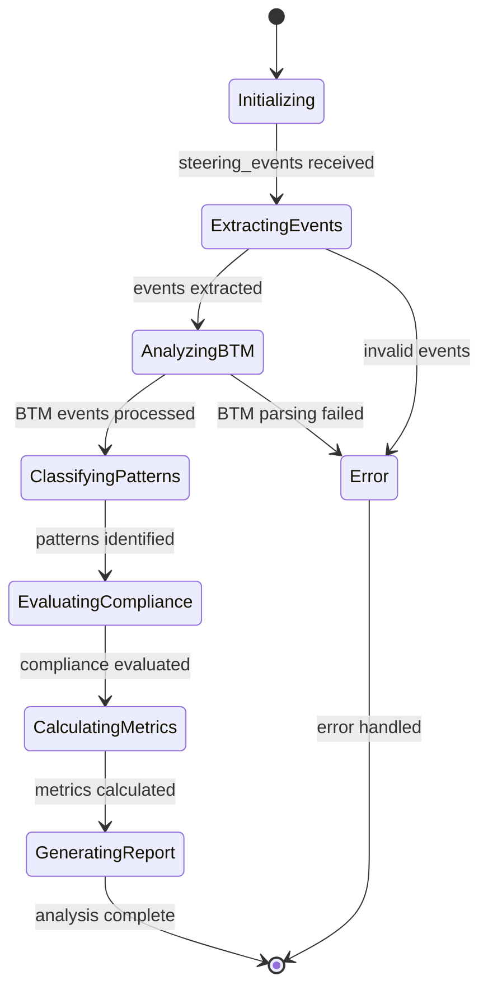
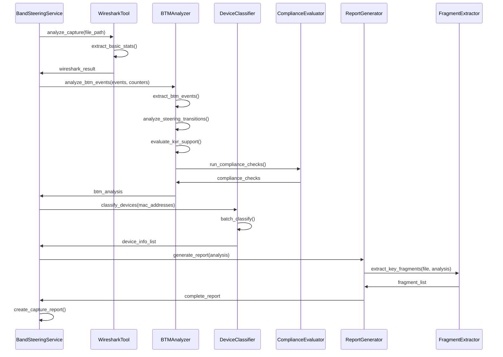

# 🔧 AIDLC - Fase 3: Diseño Detallado de Componentes

## 🎯 Especificaciones de Componentes

### 1. BTM Analyzer - Diseño Detallado

#### Responsabilidades Específicas
```yaml
Componente: BTMAnalyzer
Propósito: Análisis especializado de eventos BTM (802.11v)
Entrada: Lista de eventos 802.11 + contadores de banda
Salida: BandSteeringAnalysis estructurado
```

#### Interfaces y Contratos
```python
class BTMAnalyzer:
    def analyze_btm_events(
        self, 
        steering_events: List[Dict[str, Any]], 
        band_counters: Dict[str, Any]
    ) -> BandSteeringAnalysis:
        """
        Analiza eventos de steering y genera análisis completo
        
        Args:
            steering_events: Eventos 802.11 extraídos de tshark
            band_counters: Estadísticas de banda y BTM
            
        Returns:
            BandSteeringAnalysis: Análisis completo con métricas
            
        Raises:
            BTMAnalysisError: Error en procesamiento de eventos
            InvalidEventFormatError: Formato de evento inválido
        """
    
    def classify_btm_code(self, status_code: int) -> BTMClassification:
        """Clasifica código BTM según estándar 802.11v"""
    
    def detect_steering_pattern(
        self, 
        client_events: List[Dict[str, Any]]
    ) -> SteeringPattern:
        """Detecta patrón de steering (agresivo/asistido/preventivo)"""
    
    def calculate_transition_metrics(
        self, 
        transitions: List[SteeringTransition]
    ) -> TransitionMetrics:
        """Calcula métricas de rendimiento de transiciones"""
```

#### Algoritmos de Análisis

**Algoritmo 1: Detección de Códigos BTM**
```python
def extract_btm_events(self, steering_events, band_counters):
    """
    Extrae eventos BTM de los datos de tshark
    
    Proceso:
    1. Buscar Action Frames (subtype 13)
    2. Filtrar por Category 10 (WNM)
    3. Identificar Action Code 7 (BTM Request) y 8 (BTM Response)
    4. Extraer Status Codes de respuestas
    5. Correlacionar requests con responses por timestamp
    """
    
    btm_events = []
    for event in steering_events:
        if self._is_btm_frame(event):
            btm_event = self._parse_btm_event(event)
            btm_events.append(btm_event)
    
    return btm_events
```

**Algoritmo 2: Clasificación de Patrones de Steering**
```python
def classify_steering_pattern(self, client_events):
    """
    Clasifica el tipo de steering basado en secuencia de eventos
    
    Patrones:
    - AGGRESSIVE: Deauth/Disassoc → Reassoc
    - ASSISTED: Reassoc directa (802.11k/v/r)
    - PREVENTIVE: Cliente estable en 5GHz sin transiciones
    """
    
    has_deauth = any(e['type'] in ['Deauthentication', 'Disassociation'] 
                     for e in client_events)
    has_reassoc = any(e['type'] in ['Reassociation Request', 'Reassociation Response'] 
                      for e in client_events)
    has_5ghz_preference = self._check_5ghz_preference(client_events)
    
    if has_deauth and has_reassoc:
        return SteeringType.AGGRESSIVE
    elif has_reassoc and not has_deauth:
        return SteeringType.ASSISTED
    elif has_5ghz_preference and not (has_deauth or has_reassoc):
        return SteeringType.PREVENTIVE
    else:
        return SteeringType.UNKNOWN
```

**Algoritmo 3: Evaluación de Cumplimiento KVR**
```python
def evaluate_kvr_compliance(self, band_counters, steering_events):
    """
    Evalúa soporte de estándares 802.11k/v/r
    
    Criterios:
    - 802.11k: Presencia de Radio Measurement frames (Category 5)
    - 802.11v: Presencia de WNM frames (Category 10) + BTM
    - 802.11r: Presencia de Fast Transition en Auth/Reassoc
    """
    
    kvr_support = KVRSupport()
    
    # Detectar 802.11k
    kvr_support.k_support = band_counters.get('kvr_stats', {}).get('11k', False)
    
    # Detectar 802.11v
    has_btm = band_counters.get('btm_stats', {}).get('requests', 0) > 0
    kvr_support.v_support = has_btm or band_counters.get('kvr_stats', {}).get('11v', False)
    
    # Detectar 802.11r
    kvr_support.r_support = band_counters.get('kvr_stats', {}).get('11r', False)
    
    return kvr_support
```

#### Estados y Transiciones


### 2. Device Classifier - Diseño Detallado

#### Responsabilidades Específicas
```yaml
Componente: DeviceClassifier
Propósito: Identificación y categorización de dispositivos por MAC
Entrada: MAC addresses + metadatos opcionales
Salida: Información de marca, modelo y categoría
```

#### Interfaces y Contratos
```python
class DeviceClassifier:
    def classify_device(
        self, 
        mac_address: str, 
        device_info: Optional[Dict[str, str]] = None
    ) -> DeviceInfo:
        """
        Clasifica dispositivo por MAC address
        
        Args:
            mac_address: MAC address del dispositivo
            device_info: Información manual opcional
            
        Returns:
            DeviceInfo: Marca, modelo, categoría y OUI
        """
    
    def batch_classify(
        self, 
        mac_addresses: List[str]
    ) -> Dict[str, DeviceInfo]:
        """Clasificación en lote para múltiples dispositivos"""
    
    def get_vendor_statistics(
        self, 
        device_list: List[DeviceInfo]
    ) -> VendorStatistics:
        """Genera estadísticas por fabricante"""
```

#### Algoritmo de Clasificación
```python
def classify_device_algorithm(self, mac_address):
    """
    Algoritmo de clasificación de dispositivos
    
    Proceso:
    1. Normalizar MAC address
    2. Extraer OUI (primeros 6 caracteres)
    3. Buscar en caché local
    4. Si no existe, consultar base de datos conocidos
    5. Si no existe, consultar API externa (macvendors.com)
    6. Aplicar heurísticas de categorización
    7. Cachear resultado
    """
    
    oui = self._extract_oui(mac_address)
    
    # Búsqueda en caché
    if oui in self.cache:
        return self._create_device_info(oui, self.cache[oui])
    
    # Búsqueda en OUIs conocidos
    if oui in self.known_ouis:
        vendor = self.known_ouis[oui]
        self._cache_vendor(oui, vendor)
        return self._create_device_info(oui, vendor)
    
    # Búsqueda online
    vendor = await self._lookup_online(oui)
    if vendor:
        self._cache_vendor(oui, vendor)
        return self._create_device_info(oui, vendor)
    
    return self._create_device_info(oui, "Unknown")
```

#### Heurísticas de Categorización
```python
def categorize_device(self, vendor: str, mac_address: str) -> str:
    """
    Categoriza dispositivo basado en vendor y patrones
    
    Categorías:
    - Mobile Device: Apple, Samsung, Huawei, etc.
    - Network Equipment: Cisco, Netgear, TP-Link, etc.
    - Computer/Laptop: Intel, Realtek, Broadcom, etc.
    - Virtual Machine: VMware, VirtualBox, QEMU, etc.
    - IoT Device: Patrones específicos
    """
    
    vendor_lower = vendor.lower()
    
    if self._is_virtual_machine(mac_address):
        return "Virtual Machine"
    elif any(mobile in vendor_lower for mobile in MOBILE_VENDORS):
        return "Mobile Device"
    elif any(network in vendor_lower for network in NETWORK_VENDORS):
        return "Network Equipment"
    elif any(computer in vendor_lower for computer in COMPUTER_VENDORS):
        return "Computer/Laptop"
    else:
        return "Unknown Device"
```

### 3. Report Generator - Diseño Detallado

#### Responsabilidades Específicas
```yaml
Componente: ReportGenerator
Propósito: Generación de reportes y visualizaciones
Entrada: BandSteeringAnalysis + configuración de reporte
Salida: Reportes HTML/PDF + fragmentos de captura
```

#### Interfaces y Contratos
```python
class ReportGenerator:
    def generate_executive_report(
        self, 
        analysis: BandSteeringAnalysis,
        format: ReportFormat = ReportFormat.HTML
    ) -> ExecutiveReport:
        """Genera reporte ejecutivo con métricas clave"""
    
    def generate_technical_report(
        self, 
        analysis: BandSteeringAnalysis,
        include_fragments: bool = True
    ) -> TechnicalReport:
        """Genera reporte técnico detallado"""
    
    def generate_comparison_report(
        self, 
        analyses: List[BandSteeringAnalysis],
        group_by: str = "vendor"
    ) -> ComparisonReport:
        """Genera reporte comparativo entre dispositivos/marcas"""
    
    def extract_key_fragments(
        self, 
        capture_file: str,
        analysis: BandSteeringAnalysis
    ) -> List[CaptureFragment]:
        """Extrae fragmentos relevantes de la captura"""
```

#### Plantillas de Reporte

**Plantilla Ejecutiva**
```html
<!DOCTYPE html>
<html>
<head>
    <title>Band Steering Analysis - {{ analysis.filename }}</title>
    <style>
        /* Estilos CSS para reporte ejecutivo */
        .verdict-success { color: #28a745; }
        .verdict-warning { color: #ffc107; }
        .verdict-danger { color: #dc3545; }
        .metric-card { border: 1px solid #ddd; padding: 15px; margin: 10px; }
        .compliance-table { width: 100%; border-collapse: collapse; }
    </style>
</head>
<body>
    <header>
        <h1>Análisis de Band Steering</h1>
        <p>Archivo: {{ analysis.filename }}</p>
        <p>Fecha: {{ analysis.analysis_timestamp }}</p>
    </header>
    
    <section class="executive-summary">
        <h2>Resumen Ejecutivo</h2>
        <div class="verdict {{ verdict_class }}">
            <h3>Veredicto: {{ analysis.verdict }}</h3>
            <p>Puntuación de Cumplimiento: {{ analysis.overall_compliance_score }}%</p>
        </div>
        
        <div class="key-metrics">
            <div class="metric-card">
                <h4>Dispositivos Analizados</h4>
                <p>{{ analysis.client_devices|length }}</p>
            </div>
            <div class="metric-card">
                <h4>Transiciones Exitosas</h4>
                <p>{{ analysis.successful_transitions }}/{{ analysis.successful_transitions + analysis.failed_transitions }}</p>
            </div>
            <div class="metric-card">
                <h4>Soporte BTM</h4>
                <p>{{ "✅" if analysis.has_btm_activity else "❌" }}</p>
            </div>
        </div>
    </section>
    
    <section class="compliance-analysis">
        <h2>Análisis de Cumplimiento</h2>
        <table class="compliance-table">
            <thead>
                <tr>
                    <th>Verificación</th>
                    <th>Estado</th>
                    <th>Severidad</th>
                    <th>Detalles</th>
                </tr>
            </thead>
            <tbody>
                
                <tr>
                    <td>{{ check.check_name }}</td>
                    <td>{{ "✅ Pasó" if check.passed else "❌ Falló" }}</td>
                    <td>{{ check.severity|upper }}</td>
                    <td>{{ check.details }}</td>
                </tr>
                
            </tbody>
        </table>
    </section>
    
    <section class="recommendations">
        <h2>Recomendaciones</h2>
        <ul>
            
            <li>{{ recommendation }}</li>
            
        </ul>
    </section>
</body>
</html>
```

**Algoritmo de Extracción de Fragmentos**
```python
def extract_key_fragments(self, capture_file, analysis):
    """
    Extrae fragmentos relevantes de la captura
    
    Tipos de fragmentos:
    1. Secuencias BTM completas (Request → Response)
    2. Transiciones de steering (Deauth → Reassoc)
    3. Cambios de canal detectados
    4. Fallos de asociación
    """
    
    fragments = []
    
    # Fragmento 1: Secuencias BTM
    if analysis.has_btm_activity:
        btm_fragment = self._extract_btm_sequence(capture_file, analysis.btm_events)
        fragments.append(btm_fragment)
    
    # Fragmento 2: Transiciones exitosas
    for transition in analysis.transitions:
        if transition.is_successful:
            transition_fragment = self._extract_transition_sequence(
                capture_file, transition
            )
            fragments.append(transition_fragment)
    
    # Fragmento 3: Fallos de asociación
    if analysis.association_failures:
        failure_fragment = self._extract_failure_sequence(
            capture_file, analysis.association_failures
        )
        fragments.append(failure_fragment)
    
    return fragments
```

### 4. Fragment Extractor - Diseño Detallado

#### Responsabilidades Específicas
```yaml
Componente: FragmentExtractor
Propósito: Extracción de secuencias temporales específicas
Entrada: Archivo de captura + criterios de filtrado
Salida: Archivos pcap filtrados + metadatos
```

#### Algoritmos de Extracción

**Algoritmo 1: Extracción por Ventana Temporal**
```python
def extract_time_window(
    self, 
    capture_file: str, 
    start_time: float, 
    end_time: float,
    filter_expression: str = ""
) -> str:
    """
    Extrae fragmento por ventana temporal
    
    Proceso:
    1. Convertir timestamps a formato tshark
    2. Construir filtro temporal
    3. Aplicar filtros adicionales si se especifican
    4. Ejecutar tshark con filtros
    5. Guardar fragmento resultante
    """
    
    time_filter = f"frame.time >= {start_time} and frame.time <= {end_time}"
    
    if filter_expression:
        combined_filter = f"({time_filter}) and ({filter_expression})"
    else:
        combined_filter = time_filter
    
    output_file = self._generate_fragment_filename(start_time, end_time)
    
    cmd = [
        "tshark",
        "-r", capture_file,
        "-Y", combined_filter,
        "-w", output_file
    ]
    
    result = subprocess.run(cmd, capture_output=True, text=True)
    
    if result.returncode == 0:
        return output_file
    else:
        raise FragmentExtractionError(f"Error extracting fragment: {result.stderr}")
```

**Algoritmo 2: Extracción de Secuencia BTM**
```python
def extract_btm_sequence(self, capture_file, btm_events):
    """
    Extrae secuencia completa de BTM (Request → Response)
    
    Proceso:
    1. Identificar pares Request-Response
    2. Expandir ventana temporal (±2 segundos)
    3. Filtrar por MACs involucradas
    4. Incluir frames de contexto (Beacon, Probe)
    """
    
    if not btm_events:
        return None
    
    # Encontrar ventana temporal que cubra todos los eventos BTM
    start_time = min(event.timestamp for event in btm_events) - 2.0
    end_time = max(event.timestamp for event in btm_events) + 2.0
    
    # Construir filtro para MACs involucradas
    macs = set()
    for event in btm_events:
        macs.add(event.client_mac)
        macs.add(event.ap_bssid)
    
    mac_filter = " or ".join(f"wlan.addr == {mac}" for mac in macs if mac != "unknown")
    
    # Filtro específico para frames BTM y contexto
    btm_filter = (
        "(wlan.fc.type_subtype == 13 and "
        "(wlan.fixed.category_code == 10 or wlan.fixed.publicact == 10)) or "
        "wlan.fc.type_subtype == 8 or "  # Beacons
        "wlan.fc.type_subtype == 4 or "  # Probe Requests
        "wlan.fc.type_subtype == 5"      # Probe Responses
    )
    
    if mac_filter:
        combined_filter = f"({btm_filter}) and ({mac_filter})"
    else:
        combined_filter = btm_filter
    
    return self.extract_time_window(capture_file, start_time, end_time, combined_filter)
```

### 5. Compliance Evaluator - Diseño Detallado

#### Responsabilidades Específicas
```yaml
Componente: ComplianceEvaluator
Propósito: Evaluación de cumplimiento de estándares
Entrada: BandSteeringAnalysis
Salida: Lista de ComplianceCheck con scores
```

#### Matriz de Verificaciones
```python
COMPLIANCE_CHECKS = {
    "btm_support": {
        "name": "BTM Support (802.11v)",
        "description": "Verificar soporte de BSS Transition Management",
        "category": "btm",
        "severity": "high",
        "evaluator": "evaluate_btm_support"
    },
    "btm_success_rate": {
        "name": "BTM Success Rate",
        "description": "Verificar tasa de éxito de transiciones BTM",
        "category": "btm",
        "severity": "medium",
        "evaluator": "evaluate_btm_success_rate",
        "threshold": 0.8
    },
    "kvr_support": {
        "name": "KVR Standards Support",
        "description": "Verificar soporte de 802.11k/v/r",
        "category": "kvr",
        "severity": "medium",
        "evaluator": "evaluate_kvr_support"
    },
    "steering_loops": {
        "name": "Steering Loop Detection",
        "description": "Verificar ausencia de bucles de steering",
        "category": "performance",
        "severity": "high",
        "evaluator": "evaluate_steering_loops"
    },
    "association_success": {
        "name": "Association Success Rate",
        "description": "Verificar éxito en asociaciones/reasociaciones",
        "category": "association",
        "severity": "medium",
        "evaluator": "evaluate_association_success",
        "threshold": 0.95
    },
    "transition_performance": {
        "name": "Transition Performance",
        "description": "Verificar tiempos de transición aceptables",
        "category": "performance",
        "severity": "low",
        "evaluator": "evaluate_transition_performance",
        "threshold": 3.0  # segundos
    }
}
```

#### Algoritmos de Evaluación
```python
def evaluate_btm_support(self, analysis: BandSteeringAnalysis) -> ComplianceCheck:
    """
    Evalúa soporte de BTM
    
    Criterios:
    - Presencia de BTM Requests o Responses
    - Actividad WNM detectada
    """
    
    has_btm = analysis.btm_requests > 0 or analysis.btm_responses > 0
    has_wnm = analysis.kvr_support.v_support
    
    passed = has_btm or has_wnm
    
    details = f"BTM Requests: {analysis.btm_requests}, Responses: {analysis.btm_responses}"
    
    recommendation = None
    if not passed:
        recommendation = "Habilitar 802.11v (WNM/BTM) en la configuración del AP"
    
    return ComplianceCheck(
        check_name="BTM Support (802.11v)",
        description="Verificar soporte de BSS Transition Management",
        passed=passed,
        severity="high",
        details=details,
        recommendation=recommendation
    )

def calculate_compliance_score(self, checks: List[ComplianceCheck]) -> float:
    """
    Calcula score de cumplimiento ponderado por severidad
    
    Pesos:
    - Critical: 4
    - High: 3
    - Medium: 2
    - Low: 1
    """
    
    weights = {"critical": 4, "high": 3, "medium": 2, "low": 1}
    
    total_weight = 0
    passed_weight = 0
    
    for check in checks:
        weight = weights.get(check.severity, 1)
        total_weight += weight
        
        if check.passed:
            passed_weight += weight
    
    return passed_weight / total_weight if total_weight > 0 else 0.0
```

## 🔄 Interacciones entre Componentes

### Diagrama de Secuencia - Análisis Completo


## 📊 Métricas y Monitoreo

### Métricas por Componente

**BTM Analyzer**
- Tiempo de análisis por evento
- Precisión de detección de códigos BTM
- Tasa de clasificación correcta de patrones
- Memoria utilizada durante análisis

**Device Classifier**
- Tasa de aciertos de caché OUI
- Tiempo de respuesta de APIs externas
- Precisión de categorización de dispositivos
- Cobertura de OUIs conocidos

**Report Generator**
- Tiempo de generación por tipo de reporte
- Tamaño de reportes generados
- Tasa de éxito de extracción de fragmentos
- Uso de plantillas por formato

**Fragment Extractor**
- Tiempo de extracción por tamaño de captura
- Precisión de filtros temporales
- Compresión lograda en fragmentos
- Tasa de éxito de comandos tshark

### Dashboard de Monitoreo
```yaml
Métricas Clave:
  - Análisis completados por hora
  - Tiempo promedio de análisis
  - Tasa de errores por componente
  - Uso de recursos (CPU/Memoria)
  - Satisfacción de usuarios (ratings)

Alertas:
  - Tiempo de análisis > 5 minutos
  - Tasa de errores > 5%
  - Uso de memoria > 80%
  - API externa no disponible
  - Espacio en disco < 10%
```

---

**Próximo paso**: Proceder a la fase de Especificación de APIs y Contratos