# 📊 AIDLC - Fase 6: Gestión de Datos y Modelos

## 🎯 Estrategia de Datos

### Tipos de Datos en el Sistema
1. **Datos de Entrada**: Archivos de captura Wireshark (.pcap/.pcapng)
2. **Datos de Análisis**: Eventos 802.11 extraídos y procesados
3. **Datos de Referencia**: Documentación técnica, estándares, OUIs
4. **Datos de Salida**: Reportes, métricas, fragmentos extraídos
5. **Metadatos**: Información de dispositivos, marcas, modelos
6. **Datos de Entrenamiento**: Casos conocidos para validación de modelos

### Ciclo de Vida de los Datos

```mermaid
graph TD
    A[Captura Original] --> B[Validación y Limpieza]
    B --> C[Extracción de Eventos]
    C --> D[Análisis y Procesamiento]
    D --> E[Almacenamiento Estructurado]
    E --> F[Indexación para RAG]
    F --> G[Generación de Reportes]
    G --> H[Archivado/Retención]
    H --> I[Eliminación Programada]
```


## 🗄️ Arquitectura de Datos

### Almacenamiento Primario (PostgreSQL)
```sql
-- Política de particionado por fecha
CREATE TABLE capture_analyses_2024_01 PARTITION OF capture_analyses
FOR VALUES FROM ('2024-01-01') TO ('2024-02-01');

-- Índices especializados para consultas frecuentes
CREATE INDEX CONCURRENTLY idx_analyses_vendor_verdict 
ON capture_analyses (vendor, overall_verdict) 
WHERE analysis_timestamp >= NOW() - INTERVAL '30 days';

-- Políticas de retención automática
CREATE OR REPLACE FUNCTION cleanup_old_analyses()
RETURNS void AS $$
BEGIN
    DELETE FROM capture_analyses 
    WHERE analysis_timestamp < NOW() - INTERVAL '1 year'
    AND overall_verdict != 'FAILED';  -- Mantener fallos para análisis
END;
$$ LANGUAGE plpgsql;

-- Job programado para limpieza
SELECT cron.schedule('cleanup-analyses', '0 2 * * 0', 'SELECT cleanup_old_analyses();');
```

### Almacenamiento de Vectores (Qdrant)
```python
# Configuración de colecciones Qdrant
QDRANT_COLLECTIONS = {
    "technical_documents": {
        "vectors": {
            "size": 1536,  # OpenAI ada-002
            "distance": "Cosine"
        },
        "payload_schema": {
            "document_type": "keyword",
            "standards_covered": "keyword[]",
            "difficulty_level": "keyword",
            "btm_codes_mentioned": "integer[]"
        }
    },
    "analysis_contexts": {
        "vectors": {
            "size": 1536,
            "distance": "Cosine"
        },
        "payload_schema": {
            "analysis_id": "keyword",
            "device_vendor": "keyword",
            "verdict": "keyword",
            "compliance_score": "float"
        }
    }
}
```

### Almacenamiento de Archivos
```yaml
File Storage Strategy:
  Original Captures:
    Location: /data/captures/original/
    Retention: 90 days
    Compression: gzip
    Backup: Daily to cold storage
    
  Extracted Fragments:
    Location: /data/fragments/
    Retention: 180 days
    Organization: /vendor/model/date/
    Indexing: Metadata in PostgreSQL
    
  Generated Reports:
    Location: /data/reports/
    Retention: 1 year
    Formats: HTML, PDF, JSON
    CDN: For public reports
    
  Cache Files:
    Location: /tmp/analysis_cache/
    Retention: 24 hours
    Cleanup: Automatic on restart
```

## 🔄 Pipeline de Procesamiento de Datos

### Etapa 1: Ingesta y Validación
```python
class DataIngestionPipeline:
    """Pipeline de ingesta de datos"""
    
    def validate_capture_file(self, file_path: str) -> ValidationResult:
        """
        Valida archivo de captura
        
        Verificaciones:
        - Formato válido (pcap/pcapng)
        - Tamaño dentro de límites
        - Header correcto
        - Contenido mínimo de paquetes
        - Ausencia de malware/corrupción
        """
        
    def extract_metadata(self, file_path: str) -> CaptureMetadata:
        """
        Extrae metadatos básicos
        
        Información extraída:
        - Duración de la captura
        - Número total de paquetes
        - Interfaces de captura
        - Timestamps de inicio/fin
        - Estadísticas básicas de protocolos
        """
        
    def detect_duplicate(self, file_hash: str) -> Optional[str]:
        """
        Detecta capturas duplicadas por hash
        
        Returns:
            analysis_id si ya existe, None si es nueva
        """
```

### Etapa 2: Extracción y Enriquecimiento
```python
class DataExtractionPipeline:
    """Pipeline de extracción de datos"""
    
    def extract_802_11_events(self, file_path: str) -> List[WLANEvent]:
        """
        Extrae eventos 802.11 relevantes
        
        Eventos extraídos:
        - Management frames (Beacon, Probe, Auth, Assoc)
        - Action frames (BTM, Radio Measurement)
        - Control frames relevantes
        - Data frames para análisis de tráfico
        """
        
    def enrich_with_oui_data(self, events: List[WLANEvent]) -> List[EnrichedEvent]:
        """
        Enriquece eventos con información OUI
        
        Enriquecimiento:
        - Fabricante del dispositivo
        - Categoría de dispositivo
        - Información de modelo (si disponible)
        - Flags de dispositivo virtual
        """
        
    def correlate_events(self, events: List[EnrichedEvent]) -> List[EventSequence]:
        """
        Correlaciona eventos en secuencias lógicas
        
        Correlaciones:
        - Secuencias BTM (Request → Response)
        - Transiciones de steering (Deauth → Reassoc)
        - Sesiones de dispositivo
        - Patrones temporales
        """
```

### Etapa 3: Análisis y Clasificación
```python
class DataAnalysisPipeline:
    """Pipeline de análisis de datos"""
    
    def classify_steering_patterns(self, sequences: List[EventSequence]) -> List[SteeringPattern]:
        """
        Clasifica patrones de steering
        
        Clasificaciones:
        - Steering agresivo vs asistido
        - Éxito vs fallo de transiciones
        - Bucles de steering
        - Patrones anómalos
        """
        
    def calculate_compliance_metrics(self, patterns: List[SteeringPattern]) -> ComplianceMetrics:
        """
        Calcula métricas de cumplimiento
        
        Métricas:
        - Soporte KVR (802.11k/v/r)
        - Tasa de éxito BTM
        - Tiempos de transición
        - Estabilidad de conexiones
        """
        
    def generate_insights(self, metrics: ComplianceMetrics) -> List[Insight]:
        """
        Genera insights automáticos
        
        Insights:
        - Problemas detectados
        - Recomendaciones de mejora
        - Comparaciones con benchmarks
        - Tendencias identificadas
        """
```

## 📈 Calidad y Gobernanza de Datos

### Métricas de Calidad de Datos
```python
class DataQualityMetrics:
    """Métricas de calidad de datos"""
    
    def completeness_score(self, dataset: Dataset) -> float:
        """
        Puntuación de completitud (0-1)
        
        Verifica:
        - Campos obligatorios presentes
        - Eventos mínimos para análisis válido
        - Metadatos completos
        """
        
    def accuracy_score(self, analysis_results: List[AnalysisResult]) -> float:
        """
        Puntuación de precisión basada en validación
        
        Compara con:
        - Casos de prueba conocidos
        - Validación manual de expertos
        - Consistencia entre análisis similares
        """
        
    def consistency_score(self, related_analyses: List[Analysis]) -> float:
        """
        Puntuación de consistencia entre análisis relacionados
        
        Verifica:
        - Resultados similares para capturas similares
        - Coherencia en clasificaciones
        - Estabilidad temporal de métricas
        """
```

### Políticas de Gobernanza
```yaml
Data Governance Policies:

  Data Classification:
    Public: Reportes agregados, estadísticas generales
    Internal: Análisis específicos, métricas detalladas
    Confidential: Capturas originales, datos de clientes
    Restricted: Información de seguridad, fallos críticos

  Access Control:
    Analysts: Read access to analyses and reports
    Engineers: Full access to technical data
    Managers: Access to aggregated metrics only
    External: Public reports and documentation only

  Data Retention:
    Raw Captures: 90 days (compliance requirement)
    Analysis Results: 2 years (historical trending)
    Reports: 5 years (audit trail)
    Aggregated Metrics: Indefinite (business intelligence)

  Privacy Protection:
    MAC Address Anonymization: Automatic in reports
    Location Data Removal: Strip GPS coordinates
    Vendor Information: Aggregate only, no individual tracking
    User Consent: Required for detailed device analysis
```

## 🔍 Monitoreo y Observabilidad de Datos

### Métricas de Pipeline
```python
class DataPipelineMetrics:
    """Métricas del pipeline de datos"""
    
    def ingestion_metrics(self) -> Dict[str, float]:
        """
        Métricas de ingesta
        
        Returns:
            - files_processed_per_hour
            - average_file_size
            - validation_failure_rate
            - duplicate_detection_rate
        """
        
    def processing_metrics(self) -> Dict[str, float]:
        """
        Métricas de procesamiento
        
        Returns:
            - average_processing_time
            - events_extracted_per_file
            - analysis_success_rate
            - resource_utilization
        """
        
    def quality_metrics(self) -> Dict[str, float]:
        """
        Métricas de calidad
        
        Returns:
            - data_completeness_score
            - analysis_accuracy_score
            - consistency_score
            - user_satisfaction_rating
        """
```

### Alertas y Notificaciones
```yaml
Data Quality Alerts:

  Critical Alerts:
    - Processing failure rate > 5%
    - Data corruption detected
    - Storage capacity > 90%
    - Analysis accuracy drop > 10%

  Warning Alerts:
    - Processing time increase > 50%
    - Duplicate rate increase > 20%
    - Quality score drop > 15%
    - Unusual pattern detection

  Info Alerts:
    - New device vendor detected
    - Significant trend change
    - Benchmark threshold reached
    - Scheduled maintenance reminder
```

## 🧠 Gestión de Modelos de IA

### Versionado de Modelos
```python
class ModelVersioning:
    """Gestión de versiones de modelos"""
    
    def register_model_version(self, model_info: ModelInfo) -> str:
        """
        Registra nueva versión de modelo
        
        Información registrada:
        - Algoritmo utilizado
        - Parámetros de entrenamiento
        - Dataset de entrenamiento
        - Métricas de evaluación
        - Fecha de creación
        """
        
    def compare_model_performance(self, version_a: str, version_b: str) -> ComparisonReport:
        """
        Compara rendimiento entre versiones
        
        Métricas comparadas:
        - Precisión de detección
        - Tiempo de procesamiento
        - Uso de recursos
        - Satisfacción de usuarios
        """
        
    def rollback_model(self, target_version: str) -> bool:
        """
        Rollback a versión anterior del modelo
        
        Proceso:
        - Validar versión objetivo
        - Actualizar configuración
        - Notificar a stakeholders
        - Monitorear impacto
        """
```

### Entrenamiento Continuo
```python
class ContinuousLearning:
    """Sistema de aprendizaje continuo"""
    
    def collect_feedback_data(self, analysis_id: str, feedback: UserFeedback) -> None:
        """
        Recolecta feedback de usuarios para mejora de modelos
        
        Feedback incluye:
        - Precisión de análisis (1-5)
        - Utilidad de recomendaciones
        - Casos de falsos positivos/negativos
        - Sugerencias de mejora
        """
        
    def identify_model_drift(self, recent_analyses: List[Analysis]) -> DriftReport:
        """
        Identifica drift en el rendimiento del modelo
        
        Indicadores de drift:
        - Cambio en distribución de resultados
        - Aumento en casos edge
        - Feedback negativo consistente
        - Nuevos patrones no reconocidos
        """
        
    def trigger_retraining(self, drift_severity: float) -> bool:
        """
        Dispara reentrenamiento automático si es necesario
        
        Criterios:
        - Drift severity > threshold
        - Suficientes datos nuevos disponibles
        - Recursos computacionales disponibles
        - Aprobación de stakeholders
        """
```

## 📊 Analytics y Business Intelligence

### Dashboards de Datos
```yaml
Data Analytics Dashboards:

  Operational Dashboard:
    - Files processed today/week/month
    - Average processing time trends
    - Error rates and types
    - System resource utilization
    - Queue lengths and backlogs

  Quality Dashboard:
    - Data completeness trends
    - Analysis accuracy metrics
    - User satisfaction scores
    - Model performance indicators
    - Compliance with SLAs

  Business Dashboard:
    - Device vendor market share
    - BTM adoption trends
    - Compliance score distributions
    - Geographic analysis patterns
    - ROI metrics and cost analysis
```

### Reportes Automáticos
```python
class AutomatedReporting:
    """Sistema de reportes automáticos"""
    
    def generate_daily_summary(self) -> DailySummaryReport:
        """
        Genera resumen diario automático
        
        Incluye:
        - Análisis completados
        - Problemas detectados
        - Tendencias identificadas
        - Alertas generadas
        """
        
    def generate_weekly_insights(self) -> WeeklyInsightsReport:
        """
        Genera insights semanales
        
        Incluye:
        - Patrones emergentes
        - Comparaciones con semana anterior
        - Recomendaciones de acción
        - Predicciones de tendencias
        """
        
    def generate_monthly_business_report(self) -> MonthlyBusinessReport:
        """
        Genera reporte mensual de negocio
        
        Incluye:
        - KPIs de rendimiento
        - Análisis de ROI
        - Satisfacción de clientes
        - Roadmap de mejoras
        """
```

---

**Próximas fases a considerar**:
- **Fase 7**: Monitoreo y Observabilidad del Sistema
- **Fase 8**: Seguridad y Cumplimiento Normativo
- **Fase 9**: Documentación y Capacitación de Usuarios
- **Fase 10**: Mantenimiento y Evolución Continua