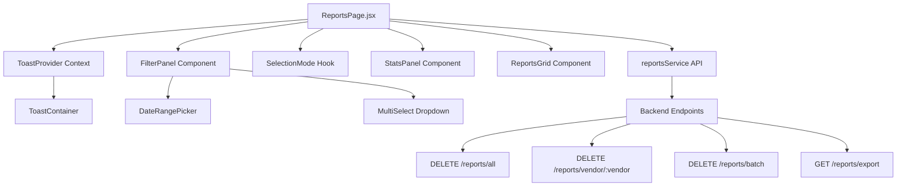

# Plan de Mejoras para Componente de Reportes

## Objetivo

Transformar el componente de reportes en una interfaz moderna, funcional y minimalista con capacidades avanzadas de gestión, filtrado y visualización.

## Arquitectura General



## Componentes y Archivos a Crear/Modificar

### 1. Sistema de Toast Notifications

**Archivos nuevos:**

- `frontend/src/components/ui/Toast.jsx` - Componente individual de toast
- `frontend/src/components/ui/ToastContainer.jsx` - Contenedor de toasts
- `frontend/src/contexts/ToastContext.jsx` - Context para manejar toasts globalmente
- `frontend/src/hooks/useToast.js` - Hook personalizado para usar toasts

**Funcionalidad:**

- Toasts con tipos: success, error, warning, info
- Auto-dismiss configurable (3-5 segundos)
- Apilamiento vertical con animaciones
- Posicionamiento en esquina superior-derecha
- Iconos y colores según tipo

### 2. Backend - Nuevos Endpoints

**Archivo:** `backend/src/api/reports.py`

**Endpoints a agregar:**

- `DELETE /reports/all` - Eliminar todos los reportes
- `DELETE /reports/vendor/{vendor}` - Eliminar todos los reportes de una marca
- `DELETE /reports/batch` - Eliminar múltiples reportes (body: `{"ids": ["id1", "id2"]}`)
- `GET /reports/export` - Exportar reportes seleccionados (query params: `ids=id1,id2,id3`)
- `GET /reports/stats` - Obtener estadísticas agregadas

### 3. Servicios Frontend

**Archivo:** `frontend/src/services/api.js`

**Métodos a agregar en `reportsService`:**

- `deleteAllReports()` - Eliminar todos
- `deleteReportsByVendor(vendor)` - Eliminar por marca
- `deleteMultipleReports(ids)` - Eliminar múltiples
- `exportReports(ids, format)` - Exportar reportes
- `getReportsStats()` - Obtener estadísticas

### 4. Componente de Filtros Avanzados

**Archivo nuevo:** `frontend/src/components/reports/FilterPanel.jsx`

**Funcionalidades:**

- Panel colapsable/expandible
- Filtro por marca (multi-select dropdown)
- Filtro por rango de fechas (date picker)
- Filtro por modelo (autocomplete)
- Filtro por veredicto mejorado (más opciones)
- Badges de filtros activos con opción de quitar
- Contador de resultados filtrados
- Botón para limpiar todos los filtros

### 5. Sistema de Selección Múltiple

**Archivo nuevo:** `frontend/src/hooks/useSelection.js`

**Funcionalidades:**

- Estado de selección múltiple (on/off)
- Seleccionar/deseleccionar individual
- Seleccionar todos / deseleccionar todos
- Contador de seleccionados
- Acciones en lote (eliminar, exportar)

**Modificaciones en ReportsPage:**

- Toggle para activar modo selección
- Checkboxes en cada card cuando está activo
- Barra de acciones flotante cuando hay seleccionados
- Atajos de teclado (Ctrl+A, Delete, Esc)

### 6. Panel de Estadísticas

**Archivo nuevo:** `frontend/src/components/reports/StatsPanel.jsx`

**Métricas a mostrar:**

- Total de reportes
- Distribución por veredicto (éxitos/fallos)
- Top 3 marcas más analizadas
- Fecha de última captura analizada
- Gráfico de barras simple para distribución

### 7. Mejoras de Diseño Minimalista

**Archivo:** `frontend/src/pages/ReportsPage.jsx`

**Cambios visuales:**

- Cards más limpias: reducir bordes, sombras sutiles
- Mejor espaciado: padding y margins consistentes
- Tipografía mejorada: jerarquía más clara
- Colores más sutiles: paleta refinada
- Iconos más pequeños y discretos
- Animaciones suaves en hover y transiciones
- Layout más respirado

### 8. Funcionalidades de Borrado

**Modificaciones en ReportsPage:**

- Botón "Eliminar todo" en header (con confirmación doble)
- Botón "Eliminar marca" en cada header de vendor
- Botón "Eliminar seleccionados" en barra de acciones
- Confirmaciones con diálogos personalizados

### 9. Formato de Fecha y Hora

**Modificaciones en ReportsPage:**

- Función `formatDateTime()` que incluye hora
- Formato: `DD/MM/YYYY HH:MM:SS`
- Mostrar hora junto a la fecha en cada card

### 10. Sistema de Ordenamiento

**Modificaciones en ReportsPage:**

- Dropdown de ordenamiento en header
- Opciones: Fecha (reciente/antiguo), Nombre (A-Z/Z-A), Marca (A-Z/Z-A), Veredicto
- Estado persistente del ordenamiento

### 11. Vista Lista vs Grid

**Archivo nuevo:** `frontend/src/components/reports/ReportsListView.jsx`

**Funcionalidades:**

- Toggle para alternar entre vista grid y lista
- Vista lista: más información visible, mejor para comparar
- Estado persistente de la vista seleccionada

### 12. Exportación de Reportes

**Funcionalidades:**

- Exportar reportes seleccionados
- Formatos: JSON, CSV
- Descarga automática del archivo
- Toast de confirmación al exportar

### 13. Búsqueda Avanzada

**Mejoras en búsqueda existente:**

- Búsqueda por MAC address
- Búsqueda por SSID
- Búsqueda combinada con filtros
- Highlight de términos encontrados

### 14. Acciones Rápidas (Menú Contextual)

**Archivo nuevo:** `frontend/src/components/reports/ReportContextMenu.jsx`

**Funcionalidades:**

- Menú al hacer click derecho en card
- Opciones: Ver detalles, Eliminar, Duplicar, Compartir
- Posicionamiento inteligente del menú

### 15. Integración de ToastProvider

**Archivo:** `frontend/src/App.jsx`

**Modificaciones:**

- Envolver aplicación con ToastProvider
- Agregar ToastContainer al layout

## Orden de Implementación

### Fase 1: Fundamentos (Alta Prioridad)

1. Sistema de Toast Notifications
2. Formato de fecha y hora
3. Funcionalidades de borrado (todo, por marca, múltiple)
4. Backend endpoints para borrado masivo

### Fase 2: Interfaz y UX (Alta Prioridad)

5. Mejoras de diseño minimalista
6. Sistema de selección múltiple
7. Panel de filtros avanzados
8. Ordenamiento

### Fase 3: Funcionalidades Avanzadas (Media Prioridad)

9. Panel de estadísticas
10. Exportación de reportes
11. Vista lista vs grid
12. Búsqueda avanzada

### Fase 4: Mejoras Adicionales (Baja Prioridad)

13. Menú contextual
14. Atajos de teclado
15. Filtros guardados (opcional)

## Detalles Técnicos

### Estructura de Datos para Selección

```javascript
const [selectionMode, setSelectionMode] = useState(false)
const [selectedIds, setSelectedIds] = useState(new Set())
```

### Estructura de Filtros

```javascript
const [filters, setFilters] = useState({
  search: '',
  status: 'ALL',
  vendors: [],
  dateRange: { start: null, end: null },
  models: [],
  sortBy: 'date',
  sortOrder: 'desc'
})
```

### Toast API

```javascript
const { showToast } = useToast()
showToast({ type: 'success', message: 'Reporte eliminado' })
```

## Consideraciones

- Mantener compatibilidad con código existente
- Usar React Query para cache y refetch automático
- Implementar loading states apropiados
- Manejar errores con toasts
- Optimizar rendimiento con useMemo y useCallback
- Responsive design para móviles
- Accesibilidad (ARIA labels, keyboard navigation)

## Testing

- Probar borrado masivo con diferentes escenarios
- Verificar que los filtros funcionan correctamente combinados
- Validar exportación de diferentes formatos
- Probar selección múltiple con muchos reportes
- Verificar que las notificaciones aparecen correctamente