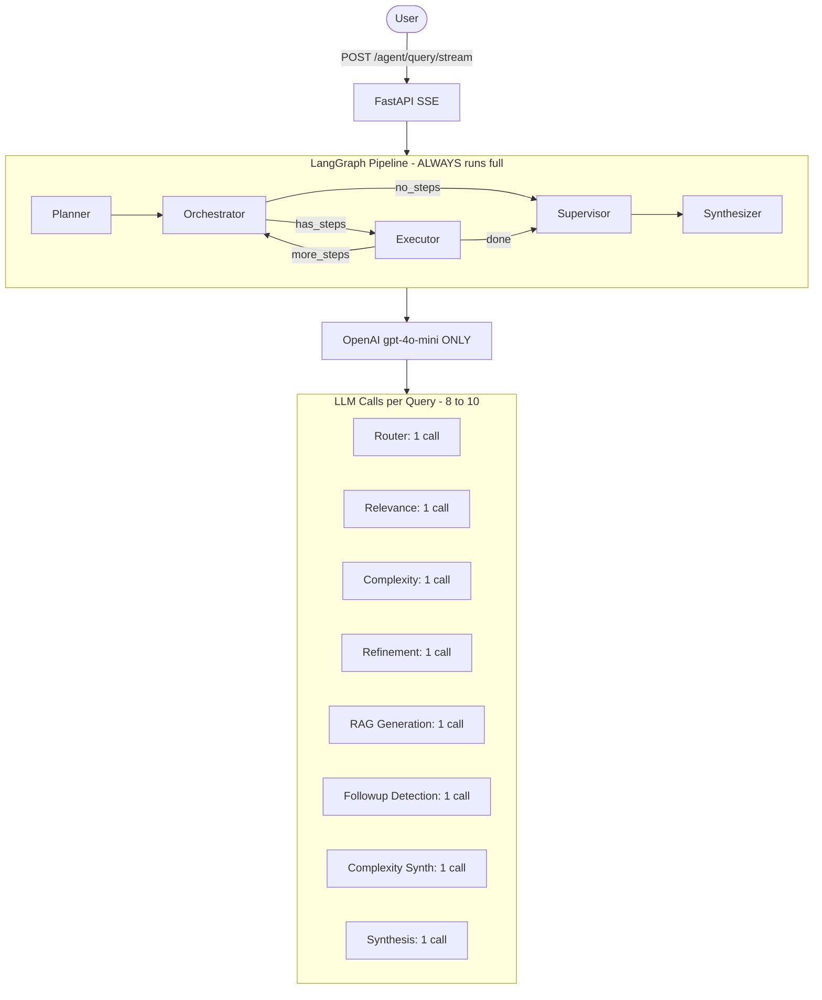
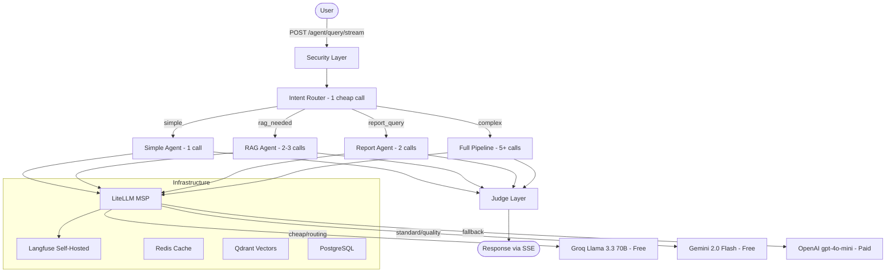

# Pipe Agent Evolution Plan

## Current Architecture Snapshot



**Problem:** Every query runs the full pipeline (8-10 LLM calls), all hardcoded to OpenAI, no observability, no security layer, no skill abstraction, all prompts in Spanish.

## Target Architecture




---

## Phase 1: LiteLLM + MSP Custom (Foundation)

**Goal:** Replace all 5 hardcoded OpenAI clients with a single abstraction that routes to Groq (fast/cheap tasks) and OpenAI (generation tasks), with OpenAI as fallback.

### 1.1 Install LiteLLM

- Add `litellm>=1.40.0` to [backend/requirements.txt](backend/requirements.txt)
- Rebuild Docker image

### 1.2 Extend settings.py

Add to [backend/src/settings.py](backend/src/settings.py):

```python
# LLM Provider Configuration
llm_provider: str = "litellm"  # "litellm" | "openai_direct"

# Model assignments per tier (updated)
llm_routing_model: str = "groq/llama-3.3-70b-versatile"      # Intent routing, classification
llm_cheap_model: str = "groq/llama-3.3-70b-versatile"        # Yes/no decisions, relevance, complexity
llm_standard_model: str = "gpt-4o-mini"                      # RAG generation, report interpretation
llm_quality_model: str = "gpt-4o"                            # Synthesis, analysis reports
llm_fallback_model: str = "gpt-4o-mini"                      # Fallback when free models fail

# Provider API keys
google_api_key: Optional[str] = None    # Google AI Studio (free)
groq_api_key: Optional[str] = None      # Groq (free)
# openai_api_key already exists          # OpenAI (paid, fallback only)

# Embeddings stay on OpenAI (best quality, Qdrant configured for 1536 dims)
embedding_provider: str = "openai"
```

### 1.3 Create MSP wrapper

Create new file `backend/src/core/llm_provider.py`:

```python
class MSPProvider:
    """Model Service Provider - unified LLM abstraction."""

    # Model map: tier -> (primary_model, fallback_model)
    TIER_MAP = {
        "routing": ("groq/llama-3.3-70b-versatile", "gpt-4o-mini"),
        "cheap":   ("groq/llama-3.3-70b-versatile", "gpt-4o-mini"),
        "standard":("gemini/gemini-2.0-flash",      "gpt-4o-mini"),
        "quality": ("gemini/gemini-2.0-flash",       "gpt-4o-mini"),
    }

    def generate(self, prompt, system_message, max_tokens, stream_callback, model_tier) -> str:
        """
        model_tier: "routing" | "cheap" | "standard" | "quality"
        - routing: intent classification, JSON structured output (Groq - fastest)
        - cheap: yes/no decisions, single-word responses (Groq - fast)
        - standard: text generation with context (Gemini - best reasoning)
        - quality: synthesis, long-form reports (Gemini - best generation)
        """

    async def agenerate(self, prompt, system_message, max_tokens, stream_callback, model_tier) -> str:
        """Async version with same interface."""
```

- Uses `litellm.completion()` internally with `fallbacks` parameter
- Tier determines which free provider to use (Groq for speed, OpenAI for generation)
- Automatic fallback to gpt-4o-mini on rate limit or error
- All calls go through this single provider
- Distributes load across free providers to maximize free tier usage

### 1.4 Refactor all LLM clients

Replace direct OpenAI usage in these 5 files:

| File                                                                         | Current                             | Change                                                   |
| ---------------------------------------------------------------------------- | ----------------------------------- | -------------------------------------------------------- |
| [backend/src/agent/llm_client.py](backend/src/agent/llm_client.py)           | `OpenAI(api_key=...)`               | Use `MSPProvider` internally, keep `LLMClient` interface |
| [backend/src/agent/router.py](backend/src/agent/router.py)                   | `client = OpenAI(...)` line 10      | Import and use `LLMClient` or `MSPProvider`              |

---

## Phase 2: Langfuse (Observability)

**Goal:** Add full observability to all LLM calls.

### 2.1 Install Langfuse

- Add Langfuse self-hosted instance to Docker Compose
- Add Langfuse Python SDK to [backend/requirements.txt](backend/requirements.txt)

### 2.2 Integrate Langfuse

- Wrap all `MSPProvider` calls with Langfuse tracing
- Add trace IDs to logs for debugging

---

## Phase 3: Skills Framework (Simplified)

**Goal:** Encapsulate reusable logic into discrete, testable skills.

### 3.1 Define BaseSkill

Create `backend/src/skills/base_skill.py`:

```python
from abc import ABC, abstractmethod

class BaseSkill(ABC):
    """Abstract base class for all skills."""
    @abstractmethod
    async def execute(self, **kwargs):
        pass
```

### 3.2 Implement Core Skills

- `IntentClassifierSkill`: Classifies query intent (simple, RAG, etc.)
- `RAGQuerySkill`: Refines queries for vector search

---

## Phase 4: Agent Dispatcher

**Goal:** Route queries to the lightest possible agent.

### 4.1 Define Dispatcher

Create `backend/src/core/agent_dispatcher.py`:

```python
class AgentDispatcher:
    """Routes queries to the appropriate agent."""
    async def dispatch(self, query, context):
        # Classify intent
        intent = await self.intent_classifier_skill.execute(query=query)
        if intent == "simple_factual":
            return await self.simple_agent.run(query, context)
        elif intent == "rag_needed":
            return await self.rag_agent.run(query, context)
        else:
            return await self.full_pipeline_agent.run(query, context)
```

---

## Phase 5: Judge System (Focused Validation)

**Goal:** Validate agent outputs only when necessary.

### 5.1 Define BaseJudge

Create `backend/src/judges/base_judge.py`:

```python
from abc import ABC, abstractmethod

class BaseJudge(ABC):
    """Abstract base class for all judges."""
    @abstractmethod
    async def judge(self, query, response, context):
        pass
```

### 5.2 Implement Judges

- `FactConsistencyJudge`: Validates RAG outputs against source documents
- `SafetyJudge`: Ensures responses are safe and appropriate

### 5.3 Integrate Judges

- Apply judges only when agent confidence is below a threshold
- Run judges in parallel to minimize latency

---

## Phase 6: English Prompts + Documentation

**Goal:** Standardize all prompts in English and improve documentation.

### 6.1 Translate Prompts

- Translate all prompts to English for better model performance

### 6.2 Add Documentation

- Document all agents, skills, and judges

---

## Phase 7: FalkorDB Integration

**Goal:** Integrate FalkorDB for advanced data management.

---

## Phase 8: Security Layer

**Goal:** Add a security layer to validate and sanitize user inputs.

---

## Phase 9: AGUI Integration

**Goal:** Enhance user experience by visualizing thought chains and procedures in real-time, replacing traditional loaders.

### 9.1 Define AGUI Requirements

- **Thought Chains Visualization:**
  - Display intermediate reasoning steps (e.g., intent classification, query refinement, document retrieval).
  - Use a dynamic, expandable tree structure to represent the flow of thought.

- **Procedure Status:**
  - Replace static loaders with real-time status updates (e.g., "Classifying intent...", "Retrieving documents...").
  - Use progress indicators for long-running tasks.

### 9.2 Implement AGUI Backend Support

- Extend `AgentDispatcher` to log intermediate steps:

```python
class AgentDispatcher:
    ...existing code...

    async def dispatch(self, query, context):
        # Log thought chain step: Intent classification
        self.log_step("Classifying intent")
        intent = await self.intent_classifier_skill.execute(query=query)

        if intent == "simple_factual":
            self.log_step("Routing to SimpleAgent")
            return await self.simple_agent.run(query, context)
        elif intent == "rag_needed":
            self.log_step("Routing to RAGAgent")
            return await self.rag_agent.run(query, context)
        else:
            self.log_step("Routing to FullPipelineAgent")
            return await self.full_pipeline_agent.run(query, context)
```

- Add `log_step` method to capture and send updates to the frontend:

```python
    def log_step(self, message: str):
        # Send step update to AGUI
        self.agui_client.send_update(message)
```

### 9.3 Update Frontend

- **Thought Chains Component:**
  - Create a new React component to render the thought chain dynamically.
  - Use a tree view or timeline visualization.

- **Procedure Status Component:**
  - Replace loaders with a status bar that updates in real-time.

Example:

```jsx
function ThoughtChain({ steps }) {
    return (
        <div className="thought-chain">
            {steps.map((step, index) => (
                <div key={index} className="step">
                    <span>{step}</span>
                </div>
            ))}
        </div>
    );
}

function ProcedureStatus({ status }) {
    return (
        <div className="procedure-status">
            <span>{status}</span>
        </div>
    );
}
```

### 9.4 Testing and Validation

- **Backend:**
  - Ensure all intermediate steps are logged correctly.
  - Validate that logs are sent to the frontend in real-time.

- **Frontend:**
  - Test visualization with various thought chain lengths.
  - Ensure smooth transitions between statuses.

---

## Summary

The AGUI integration will replace traditional loaders with dynamic, real-time visualizations of thought chains and procedures, improving transparency and user experience.


